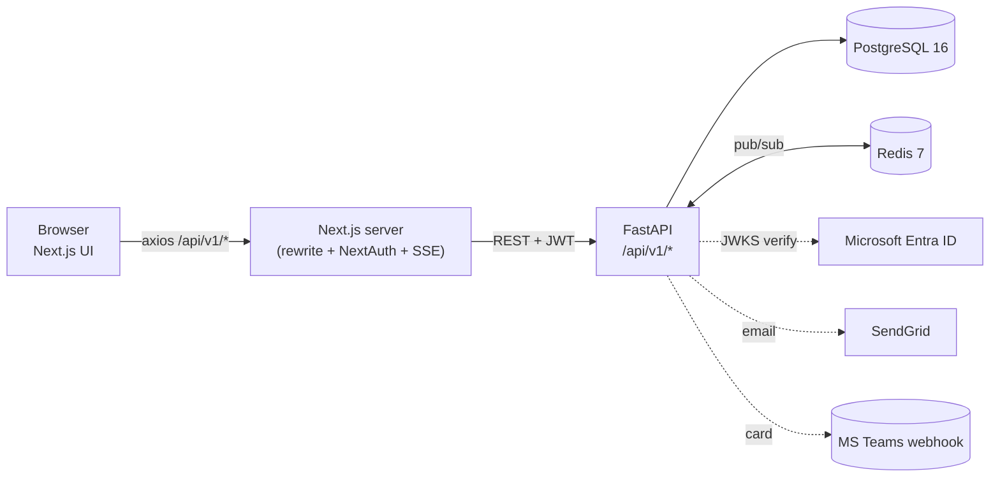

# In-House Goal Setting & Tracking Portal

A production-ready internal platform for goal-setting, manager approvals, quarterly check-ins, KPI cascading, and real-time tracking. Built for organizations that need an in-house alternative to commercial OKR tools.

[](https://github.com/Helios337/In-House-Goal-Setting-Tracking-Portal/actions/workflows/ci.yml)


---

## Table of contents

1. [Highlights](#highlights)
2. [Architecture](#architecture)
3. [Tech stack](#tech-stack)
4. [Project structure](#project-structure)
5. [Quick start (5 minutes)](#quick-start-5-minutes)
6. [Detailed setup](#detailed-setup)
7. [API surface](#api-surface)
8. [Demo data & roles](#demo-data--roles)
9. [Real-time events](#real-time-events)
10. [Testing](#testing)
11. [Deployment](#deployment)
12. [Configuration reference](#configuration-reference)
13. [Troubleshooting](#troubleshooting)
14. [Security notes](#security-notes)
15. [Roadmap](#roadmap)
16. [Contributing](#contributing)
17. [License](#license)

---

## Highlights

- **Goal sheet workflow** — employees draft up to 8 weighted goals (totaling 100%), submit for approval, managers approve.
- **Quarterly check-ins** — managers log structured feedback on each subordinate's progress with audit trail.
- **KPI cascading** — admins broadcast manager goals down the org tree as shared sub-goals.
- **Real-time dashboards** — Server-Sent Events stream goal/approval/notification changes; UI invalidates SWR caches instantly.
- **Role-based access** — Employee, Manager, Admin layouts and routes gated server-side and client-side.
- **Audit log** — every mutation recorded immutably with actor, action, entity, timestamp.
- **Escalations** — APScheduler job auto-creates escalation records for sheets/check-ins past SLA.
- **Pluggable auth** — local credentials for dev; Microsoft Entra ID (Azure AD) OIDC for production.
- **Integrations** — optional SendGrid email and Microsoft Teams webhook notifications.

---

## Architecture



A deeper deep-dive — including sequence diagrams for auth, the goal lifecycle state machine, the real-time pub/sub flow, and the deployment topology — lives in [`docs/architecture.md`](./docs/architecture.md). The ER diagram for the database lives in [`docs/data-model.md`](./docs/data-model.md).

---

## Tech stack

| Layer | Choice | Why |
|-------|--------|-----|
| Frontend | **Next.js 15** (App Router), React 18, TailwindCSS, SWR, Zustand, Lucide icons | SSR + RSC + strong DX; SWR for cache-with-realtime invalidation |
| Auth (web) | **NextAuth** with Credentials + Azure AD providers | Cookie-session model; clean Entra ID integration |
| Backend | **FastAPI** (Python 3.11), Pydantic v2, SQLAlchemy 2.0, Alembic | Type-safe routes, auto OpenAPI docs |
| Auth (api) | **JWT HS256** (own issuer) + RS256 verify of Entra `id_token` via `python-jose` | Stateless API, optional federated SSO |
| DB | **PostgreSQL 16** | Production-grade RDBMS with healthchecks |
| Cache / pub-sub | **Redis 7** | Event bus for SSE fan-out |
| Real-time | **SSE** via `sse-starlette` + Redis subscribe per connected user | Lightweight, firewall-friendly |
| Background jobs | **APScheduler** in-process | Hourly escalation sweeps |
| Integrations | **SendGrid**, **MS Teams webhook**, **msal** (optional) | Plug-in notification + auth |
| Container | **Docker Compose** (4 services) + **Kubernetes** manifests template | Same image runs locally and in prod |
| CI | **GitHub Actions** — backend pytest, frontend lint + build | Fail-fast on PR |

---

## Project structure

```
.
├── backend/                  FastAPI service
│   ├── app/
│   │   ├── main.py           App init, CORS, scheduler lifespan
│   │   ├── config.py         Pydantic settings (DATABASE_URL, JWT_SECRET, …)
│   │   ├── core/             DB engine, security, Entra ID JWKS verify
│   │   ├── dependencies.py   JWT decode, RBAC require_*_role
│   │   ├── models/           SQLAlchemy ORM (User, GoalSheet, Goal, …)
│   │   ├── schemas/          Pydantic request/response models
│   │   ├── routers/          REST endpoints, mounted at /api/v1/*
│   │   ├── services/         Domain logic (goal, checkin, achievement, …)
│   │   └── events/           DomainEvent types + Redis channel helpers
│   ├── alembic/              Migrations (0001 → 0005)
│   ├── tests/                pytest suite (36 tests, SQLite in-memory)
│   ├── scripts/              migrate.sh, seed.py, smoke_test.py
│   └── requirements.txt
├── frontend/                 Next.js 15 application
│   ├── src/
│   │   ├── app/              App-router routes (employee/, manager/, admin/, api/)
│   │   ├── components/       UI primitives + role-aware shells
│   │   ├── hooks/            useRealtime (SSE), useGoals, useNotifications
│   │   ├── lib/              api.ts (axios), auth-options.ts, goal-api.ts, roles.ts
│   │   ├── providers/        SessionProvider, RealtimeProvider (toast)
│   │   └── types/            next-auth.d.ts, api.ts
│   ├── next.config.js        Rewrites /api/v1/* → backend
│   └── package.json
├── infra/
│   ├── Dockerfile.backend    Multi-stage, uvicorn 4 workers
│   ├── Dockerfile.frontend   Next standalone output
│   ├── nginx.conf            Reverse-proxy example
│   └── k8s/                  Deployment, Service, Ingress manifests
├── docs/
│   ├── architecture.md       System, auth, lifecycle, realtime diagrams
│   ├── data-model.md         ER diagram + business rules
│   └── api-spec.yaml         OpenAPI spec (generated)
├── docker-compose.yml        4-service local stack
├── .env.example              Template (POSTGRES_PASSWORD, JWT_SECRET, …)
├── .github/workflows/ci.yml  Pytest + lint + build
├── LICENSE                   MIT
└── Readme.md                 (this file)
```

---

## Quick start (5 minutes)

> Requires Docker Desktop, Python 3.11+, Node 18+. Verified on macOS, Linux, Windows (WSL2).

```bash
# 1. Clone
git clone https://github.com/Helios337/In-House-Goal-Setting-Tracking-Portal.git
cd In-House-Goal-Setting-Tracking-Portal

# 2. Generate secrets and create .env from template
cp .env.example .env
# Open .env and replace these two values:
#   POSTGRES_PASSWORD=$(openssl rand -base64 24)
#   JWT_SECRET=$(openssl rand -base64 32)

# 3. Frontend env
cp frontend/.env.local.example frontend/.env.local
# Replace NEXTAUTH_SECRET with $(openssl rand -base64 32)
# For NATIVE dev, set:
#   NEXT_PUBLIC_API_URL=http://localhost:8000
#   API_BASE_URL=http://127.0.0.1:8000

# 4. Start Postgres + Redis
docker compose up -d postgres redis

# 5. Backend
cd backend
python3 -m venv .venv
source .venv/bin/activate           # Windows: .venv\Scripts\Activate.ps1
pip install -r requirements.txt pytest
./scripts/migrate.sh                # runs alembic upgrade head + seed.py
uvicorn app.main:app --reload --host 0.0.0.0 --port 8000 &

# 6. Frontend (new terminal)
cd ../frontend
npm install
npm run dev
```

Open **http://localhost:3000** and log in with the [demo accounts below](#demo-data--roles).

---

## Detailed setup

### Option A — Native dev (recommended for development)

Postgres + Redis run as Docker containers; backend and frontend run on the host for fast iteration.

1. **Prereqs** — Docker, Python 3.11+, Node 18+.
2. **Env files** — copy `.env.example` → `.env`, fill `POSTGRES_PASSWORD` and `JWT_SECRET`. Copy `frontend/.env.local.example` → `frontend/.env.local`, fill `NEXTAUTH_SECRET`, point `NEXT_PUBLIC_API_URL=http://localhost:8000`.
3. **Infra** — `docker compose up -d postgres redis`. Wait for `docker compose ps` to show both `healthy`.
4. **Backend venv** — see Quick start step 5.
5. **Migrate + seed** — `./scripts/migrate.sh` (Mac/Linux) or run `alembic upgrade head` then `python -m scripts.seed` manually (Windows).
6. **Run** — `uvicorn app.main:app --reload` and `npm run dev`.

### Option B — Full Docker (recommended for staging/demo)

Everything runs in containers; API is exposed on host port 4000.

```bash
cp .env.example .env
# edit POSTGRES_PASSWORD, JWT_SECRET, NEXTAUTH_SECRET
docker compose up -d --build
```

Open:
- Web: http://localhost:3000
- API: http://localhost:4000/docs

> ⚠️ When using full Docker, `frontend/.env.local` is overridden by environment vars set in `docker-compose.yml` (`NEXT_PUBLIC_API_URL=http://localhost:4000`). Do not run both modes simultaneously.

### Reset the database

```bash
docker compose down -v       # wipes the Postgres volume
docker compose up -d postgres redis
cd backend && source .venv/bin/activate && ./scripts/migrate.sh
```

---

## API surface

Mounted at `/api/v1` — full Swagger UI at `http://localhost:8000/docs` when the API is running.

| Group | Selected endpoints |
|-------|--------------------|
| **Authentication** | `POST /auth/login`, `POST /auth/sso` |
| **Users** | `GET /users/me`, `GET /users` (admin) |
| **Cycles** | `GET /cycles`, `POST /cycles` (admin) |
| **Goals** | `GET /goals/sheets`, `GET /goals/sheets/current`, `POST /goals/`, `POST /goals/{sheet_id}/submit`, `POST /goals/{sheet_id}/approve`, `GET /goals/manager/pending-approvals` |
| **Shared goals** | `GET /shared-goals/cascade-options` (admin), `POST /shared-goals/admin/cascade`, `POST /shared-goals/push` |
| **Achievements** | `POST /achievements/`, `GET /achievements/by-goal/{goal_id}` |
| **Manager check-ins** | `GET /checkins/team`, `GET /checkins/employee/{id}`, `POST /checkins/` |
| **Reports** | `GET /reports/dashboard`, `GET /reports/export` (CSV) |
| **Audit log** | `GET /audit`, `GET /audit-logs` |
| **Real-time** | `GET /events/stream` (SSE) |
| **Notifications** | `GET /notifications`, `POST /notifications/{id}/read` |
| **Team goals** | `GET /team-goals` |

The full machine-readable spec lives in [`docs/api-spec.yaml`](./docs/api-spec.yaml).

---

## Demo data & roles

`scripts/seed.py` creates the following:

| Email | Password | Role | Default landing page |
|-------|----------|------|----------------------|
| `employee@demo.example.com` | `demo123` | EMPLOYEE | `/employee/goals` |
| `manager@demo.example.com` | `demo123` | MANAGER | `/manager/dashboard` |
| `admin@demo.example.com` | `demo123` | ADMIN | `/admin/dashboard` |

Org hierarchy: `manager@demo` is the direct manager of `employee@demo`. There is one `CheckinCycle` ("FY 2026") with two active `PhaseWindow`s, and three `ThrustArea`s (Sales Revenue, Operational TAT, Safety Compliance).

> The dev login form ignores the password field (uses `/auth/sso` with `ALLOW_INSECURE_SSO=true`) and trusts the role dropdown. Disable `ALLOW_INSECURE_SSO` and wire up Entra ID for production.

---

## Real-time events

The backend publishes `DomainEvent`s to Redis channels:

| Channel | Subscribers | Sample events |
|---------|-------------|---------------|
| `user:{id}` | one user | `notification.created`, `goal.sheet.approved` |
| `team:{manager_id}` | one manager | `goal.sheet.submitted` |
| `goal:{id}` | watchers of a goal | `goal.updated`, `shared_kpi.pushed` |

The frontend `useRealtime` hook opens `EventSource('/api/events/stream')` (Next route → backend SSE → Redis subscribe) and:

- calls `mutate(...)` on matching SWR keys to refetch fresh data, and
- raises a toast through `RealtimeProvider` for user-visible events.

See [`docs/architecture.md`](./docs/architecture.md) §4 for the full sequence.

---

## Testing

```bash
# Backend (36 tests, SQLite in-memory, ~0.3s)
cd backend && source .venv/bin/activate
pytest -q

# Frontend
cd frontend
npm run lint
npm run build
```

CI (`.github/workflows/ci.yml`) runs both on every push/PR to `main`.

### End-to-end smoke

`backend/scripts/smoke_test.py` stands up an in-memory SQLite, hits the full REST flow (login → create goals → submit → approve → check-in), and asserts every step returns 200. Run after dependency upgrades:

```bash
cd backend && PYTHONPATH=. python scripts/smoke_test.py
```

---

## Deployment

### Docker Compose (single host)

Production-ish single-node deploy. Put a TLS-terminating reverse proxy (Nginx, Caddy) in front of `:3000` and `:4000`.

```bash
docker compose up -d --build
```

### Kubernetes

Manifests under [`infra/k8s/`](./infra/k8s/) are templates — supply your own:
- Managed Postgres (RDS / Cloud SQL) connection string in a `Secret`.
- Managed Redis URL.
- TLS-terminating Ingress with your domain.
- Image references via your container registry.

```bash
kubectl apply -f infra/k8s/
```

### Image build

```bash
docker build -f infra/Dockerfile.backend  -t myrepo/goal-api:latest backend
docker build -f infra/Dockerfile.frontend -t myrepo/goal-web:latest frontend
```

---

## Configuration reference

All settings come from the project-root `.env` (loaded by Docker Compose, `backend/scripts/migrate.sh`, and the FastAPI `Settings` class) and `frontend/.env.local` (loaded by Next.js).

### Backend `.env` (selected keys)

| Key | Default | Purpose |
|-----|---------|---------|
| `POSTGRES_USER` / `POSTGRES_PASSWORD` / `POSTGRES_DB` | `goal_user` / required / `goal_portal` | DB credentials |
| `POSTGRES_HOST` / `POSTGRES_PORT` | `localhost` / `5432` | Native dev points at `localhost`; container points at service name `postgres` |
| `DATABASE_URL` | derived | Override to use a non-`POSTGRES_*` connection |
| `REDIS_URL` | `redis://localhost:6379/0` | Use `redis://redis:6379/0` inside Compose |
| `JWT_SECRET` | required | HS256 secret for own JWTs (≥ 32 bytes) |
| `ALLOW_INSECURE_SSO` | `true` (dev only) | Let `/auth/sso` accept email without verifying an `id_token` |
| `ENTRA_CLIENT_ID` / `ENTRA_TENANT_ID` / `ENTRA_CLIENT_SECRET` | unset | Required when `ALLOW_INSECURE_SSO=false` |
| `EMAIL_PROVIDER`, `SENDGRID_API_KEY`, `EMAIL_FROM` | unset | Outbound email |
| `TEAMS_WEBHOOK_URL` | unset | Outbound Teams card |
| `ESCALATION_SHEET_HOURS` / `ESCALATION_CHECKIN_HOURS` | `48` / `72` | SLA thresholds |

### Frontend `.env.local`

| Key | Native dev | Compose |
|-----|------------|---------|
| `NEXT_PUBLIC_API_URL` | `http://localhost:8000` | `http://localhost:4000` |
| `API_BASE_URL` | `http://127.0.0.1:8000` | `http://api:8000` |
| `NEXTAUTH_URL` | `http://localhost:3000` | same |
| `NEXTAUTH_SECRET` | required (≥ 32 bytes) | required |
| `AZURE_AD_CLIENT_ID` / `AZURE_AD_CLIENT_SECRET` / `AZURE_AD_TENANT_ID` | optional | required for real SSO |

---

## Troubleshooting

| Symptom | Cause | Fix |
|---------|-------|-----|
| `connection to server at "localhost"… password authentication failed for user "goal_user"` | Postgres volume was created with an old password | `docker compose down -v && docker compose up -d postgres redis`, re-run migrations |
| Login shows "Login failed. Ensure the API is running and database is seeded." | API down, wrong port, or stale uvicorn | `curl http://127.0.0.1:8000/`. If `Internal Server Error`, restart uvicorn |
| `/api/auth/error` shows `{"detail":"Not Found"}` | Next.js rewrite is too broad (`/api/:path*`) | Already fixed: rewrite is scoped to `/api/v1/:path*` |
| Browser console: CORS error on `localhost:4000` | Origin not in allow-list | Check `BACKEND_CORS_ORIGINS` in `backend/app/config.py` |
| `command not found: pytest` / `alembic` | venv not activated | `cd backend && source .venv/bin/activate` |
| `node:os… uv_interface_addresses returned Unknown system error 1` | Restricted Node sandbox blocking `os.networkInterfaces()` | Start `npm run dev` from a regular terminal (no sandbox wrapper) |
| Manager dashboard shows no sheets | Logged-in manager is not in `org_hierarchy` for any employee | Use seeded `manager@demo.example.com` or insert hierarchy rows |
| Frontend can build but live updates don't arrive | Redis down or browser was opened before login (SSE has no token) | Reload the page after login; check `docker compose ps redis` |

---

## Security notes

- **Production checklist**
  - [ ] `ALLOW_INSECURE_SSO=false` and Entra ID variables set.
  - [ ] `JWT_SECRET`, `NEXTAUTH_SECRET`, `POSTGRES_PASSWORD` come from a secret manager (Vault, AWS SM, GCP SM, Doppler), not committed.
  - [ ] CORS allow-list restricted to your production domain only.
  - [ ] TLS terminated at the edge (Nginx / Ingress / load balancer).
  - [ ] Postgres backups configured (managed service preferred).
  - [ ] Audit-log retention policy defined.
- The `.gitignore` excludes `.env`, `.env.local`, `.venv/`, and `*.db` — verify before committing.
- The repo never stores plaintext secrets; the `.env.example` files use placeholders.

---

## Roadmap

Tracked priorities (not commitments):

- [ ] Add `GET /thrust-areas` endpoint and wire the goal form to send `thrust_area_id`.
- [ ] Replace the credentials login shortcut with real bcrypt verification against `users.hashed_password`.
- [ ] Frontend: remove the 8 lingering `any` types and 2 unused imports.
- [ ] E2E test in CI (Playwright against a Compose stack).
- [ ] Email + Teams integration tests with a mock SMTP / webhook.
- [ ] Audit log UI filtering (actor, action, date range).
- [ ] Mobile responsive polish on `/manager/dashboard`.
- [ ] Multi-cycle reporting (compare FY-over-FY progress).

---

## Contributing

1. Fork and create a feature branch from `main`.
2. Backend: run `pytest -q` and ensure no new lint regressions.
3. Frontend: run `npm run lint && npm run build`.
4. Open a PR with a clear description; CI must pass.
5. Use the existing commit style (`feat:`, `fix:`, `docs:`, `chore:`).

---

## License

[MIT](./LICENSE)
