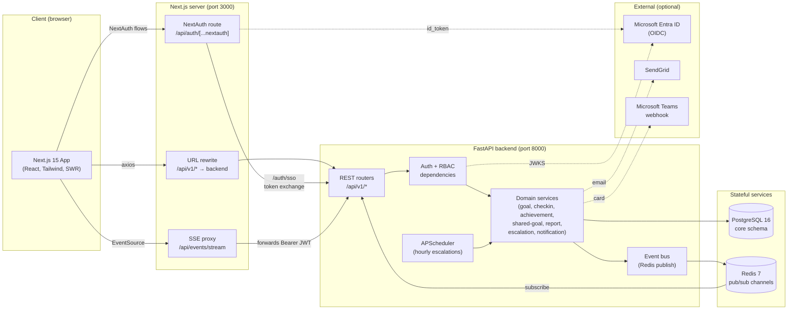
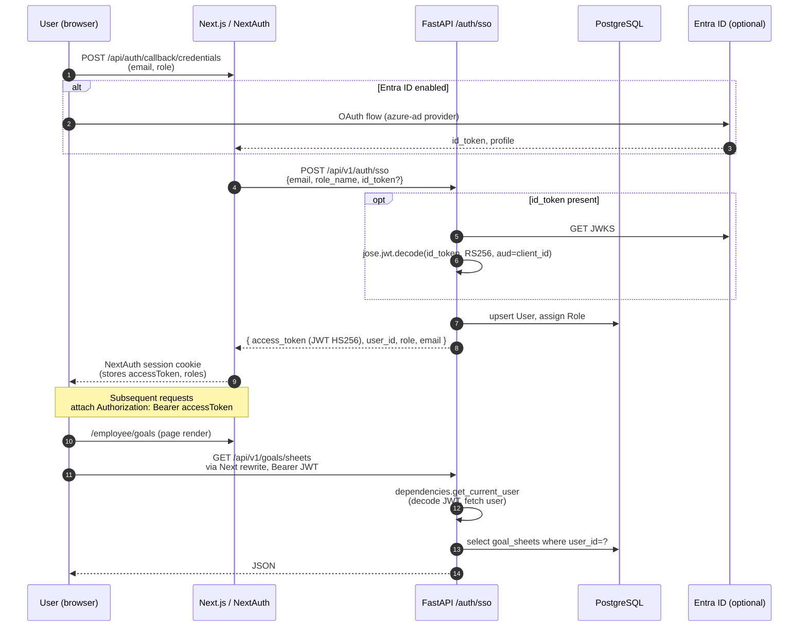
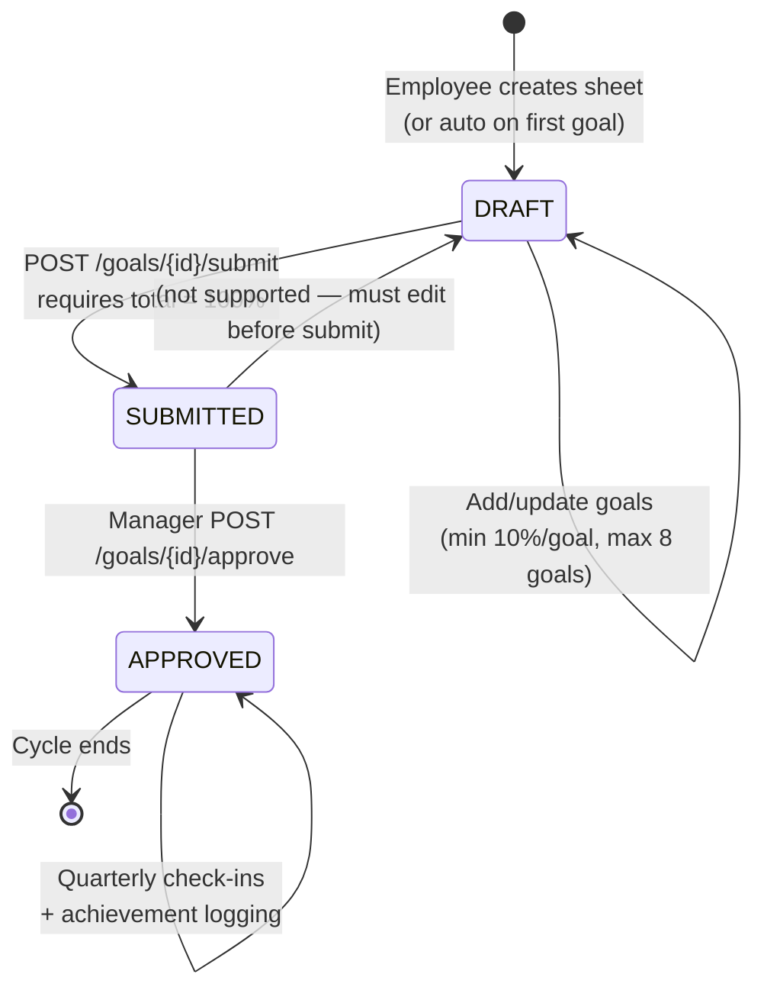
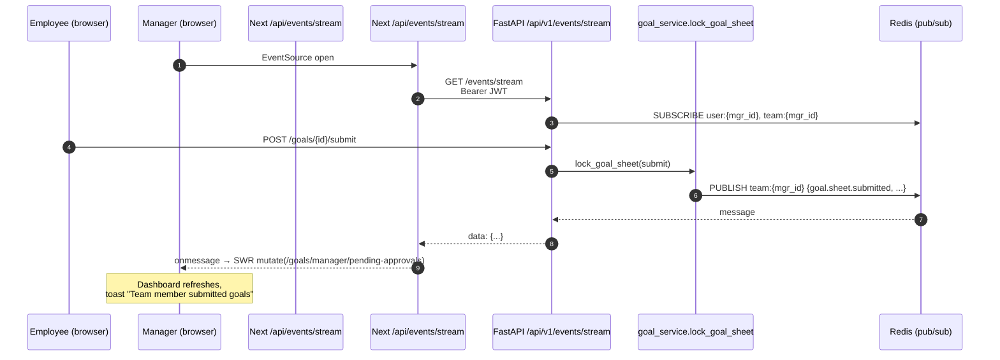
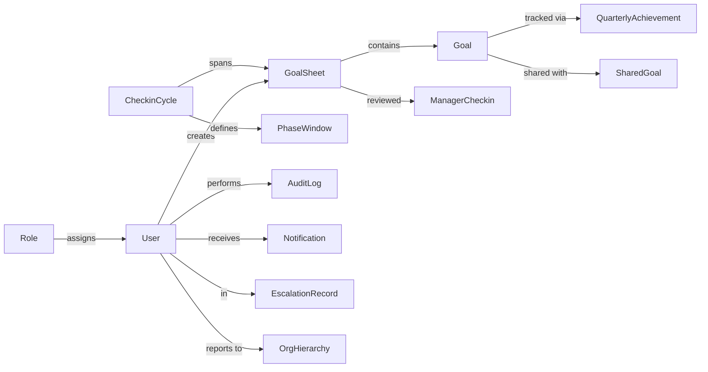
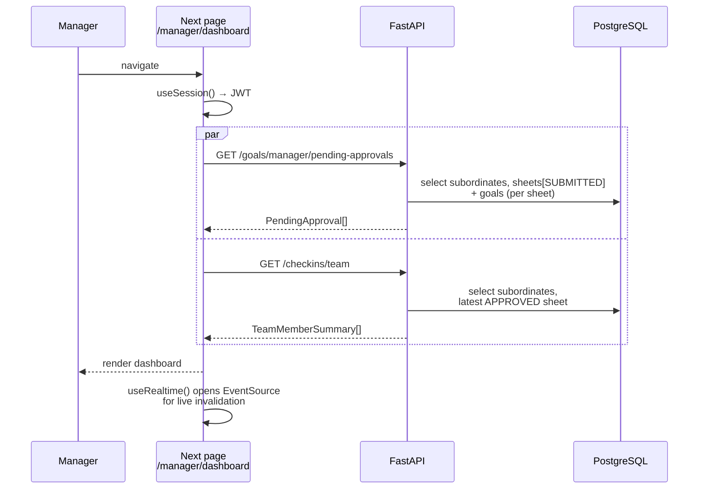
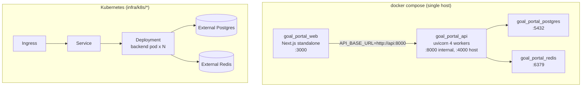

# Architecture

This document describes the **as-built** architecture of the In-House Goal Setting & Tracking Portal.

All diagrams below render natively on GitHub (Mermaid).

> **README banner:** [`architecture.png`](./architecture.png) is exported from [`architecture-overview.mmd`](./architecture-overview.mmd). Regenerate with `python3 docs/generate_architecture_svg.py` then `npx @resvg/resvg-js` (see script header).

---

## 1. System overview

**Key points**

- The browser never talks directly to PostgreSQL or Redis.
- Two paths reach the backend:
  - Browser → Next rewrite (`/api/v1/*` → backend) for normal REST.
  - Browser → Next route (`/api/events/stream`) which forwards the Bearer JWT to the backend SSE endpoint.
- Real-time updates: backend services publish `DomainEvent`s to Redis channels (`user:{id}`, `team:{manager_id}`, `goal:{id}`). The SSE endpoint subscribes per connected user and streams events to the browser, which invalidates SWR caches and shows toasts.
- A background `APScheduler` job runs hourly inside the API process to create escalation records when sheets/check-ins age beyond their SLA.

---

## 2. Authentication & authorization

**RBAC**

| Layer | Mechanism |
|-------|-----------|
| Frontend | `RoleGuard` + per-route `layout.tsx` (`UI_ROLES`) |
| Backend | `dependencies.require_manager_role`, `require_admin_role` |
| Token | JWT `sub` = `users.id`; role re-read from DB each request (not from claims) |

---

## 3. Goal lifecycle

**Server-enforced invariants** (`backend/app/services/goal_service.py`):

| Invariant | Function |
|-----------|----------|
| ≤ 8 goals/sheet | `validate_goal_count` |
| ≥ 10% per goal | `validate_single_goal_weight` |
| Total = 100% on submit | `validate_sheet_ready_for_submit` |
| Sheet locked after submit/approve | `check_sheet_lock` |
| Phase window must be active | `cycle_service.require_phase_active` |

---

## 4. Real-time event flow

**Channels** (`backend/app/events/types.py`):

| Channel | Subscribers |
|---------|-------------|
| `user:{id}` | Single user (notifications, own goal updates) |
| `team:{manager_id}` | Manager dashboards |
| `goal:{id}` | Anyone viewing/sharing the goal |

**Event types** (subset): `goal.sheet.submitted`, `goal.sheet.approved`, `goal.updated`, `shared_kpi.pushed`, `checkin.created`, `achievement.updated`, `notification.created`, `escalation.created`.

---

## 5. Data model

See [`data-model.md`](./data-model.md) for the full ER diagram and business-rule mapping.

Quick summary:

---

## 6. Request fan-out (manager dashboard load)

---

## 7. Deployment topology

**Compose** (`docker-compose.yml`) is the default local/staging deploy. **Kubernetes** manifests under `infra/k8s/` are templates for production; you supply a real Postgres + Redis (managed) and your own `Secret` / `ConfigMap`.

---

## 8. Security model

| Concern | Mitigation |
|---------|------------|
| JWT secret | `JWT_SECRET` env var, HS256, validated on every request |
| Password storage | `bcrypt` via `passlib`/`bcrypt` lib (used by `/auth/login`) |
| Entra ID tokens | RS256 verified against Microsoft JWKS, audience = client_id, issuer pinned |
| CORS | Allow-list of dev origins (`localhost:3000/4000/8000`) — restrict in prod |
| SSO bypass for dev | `ALLOW_INSECURE_SSO=true` lets `/auth/sso` accept email without `id_token` — **must be `false` in production** |
| Role tampering | Role looked up from DB each request, never trusted from JWT claims |
| Audit | Every mutation logs to `audit_logs` with actor, action, entity ref, timestamp |

---

## 9. Failure modes

| Failure | Effect | Recovery |
|---------|--------|----------|
| Redis down | Event publish logs a warning; REST keeps working; live UI stops updating | Restart Redis; refresh browser |
| Postgres down | All API calls return 500 | Restart Postgres; check `pool_pre_ping` reconnects |
| Email/Teams webhook down | Background task fails silently with logs | Re-run notification (idempotent on `audit_log`) |
| Entra ID JWKS unreachable | SSO with `id_token` rejected | Fall back to credentials provider or fix network |
| Scheduler crash | No new escalations created | API process restart; APScheduler re-arms on lifespan |
