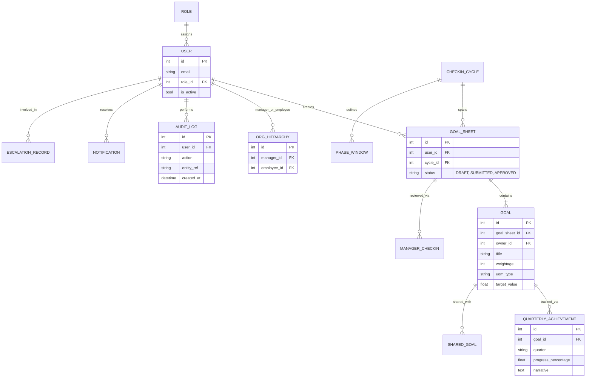

# Data Model & ER Diagram

This document reflects the **implemented** PostgreSQL schema (integer primary keys).

## Entity Relationship Diagram

## Approval trail

There is no separate `approval_logs` table. Approvals are recorded as:

- `goal_sheets.status` transitions (`SUBMITTED` → `APPROVED`)
- `audit_logs` entries with actions `SUBMIT_SHEET` and `APPROVE_SHEET`

## Real-time layer

Redis pub/sub backs Server-Sent Events (`/api/v1/events/stream`) for notifications and goal updates.

## Business rules (server-enforced)

| Rule | Enforcement |
|------|-------------|
| Max 8 goals per sheet | `goal_service.validate_goal_count` |
| Min 10% per goal | `goal_service.validate_single_goal_weight` |
| Total weightage = 100% | `goal_service.validate_sheet_ready_for_submit` on submit/approve |
| Goal lock after approval | `goal_service.check_sheet_lock` |
| Phase windows | `cycle_service.require_phase_active` on goal and achievement mutations |
